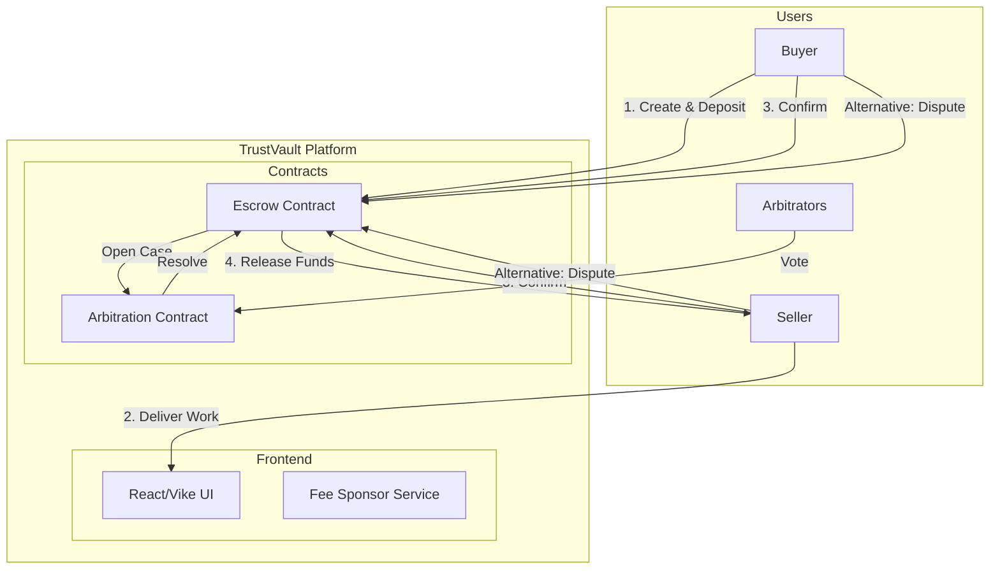
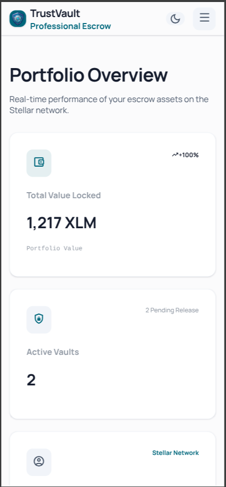
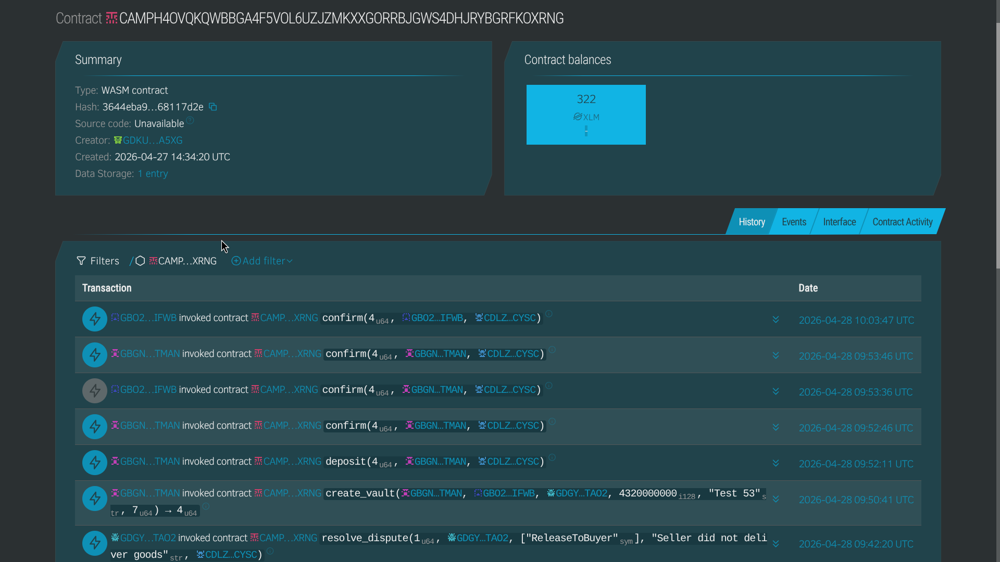
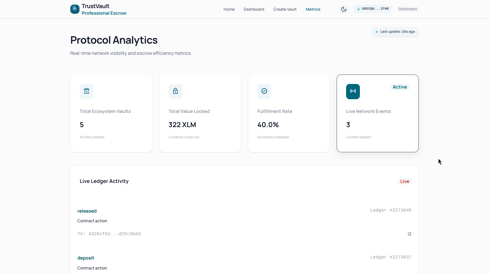

# 🔐 TrustVault

Decentralized escrow on Stellar.

[](https://github.com/sharifmdathar/trustvault/actions/workflows/ci.yml)

TrustVault is a secure, decentralized escrow platform built on the Stellar network using Soroban smart contracts. It enables trustless transactions between buyers and sellers with built-in arbitration and fee sponsorship for a seamless user experience.

---

## Demo Video
[](https://youtu.be/GgBaDCy7JLM)

## 🚀 Live Demo 

- **Live Demo**: [trustvault-ten.vercel.app](https://trustvault-ten.vercel.app/)

## Contact Addresses
- **Escrow Contract**: `CAMPH4OVQKQWBBGA4F5VOL6UZJZMKXXGORRBJGWS4DHJRYBGRFKOXRNG`
- **Arbitration Contract**: `CAZLZGITOGMTNO7WAAESD5WQUBPRFVZPVT7LLFEAJGUWHYHA2EO3U2F2`

---

## 🏗 Architecture Diagram



---

## 📖 How to Use (Step by Step)

1.  **Connect**: Link your Freighter wallet to the TrustVault dashboard.
2.  **Create**: As a Buyer, create a new vault by providing the Seller's address and the amount.
3.  **Fund**: Deposit the agreed-upon XLM into the secure escrow contract.
4.  **Confirm**: Once work is completed, both parties click **Confirm**.
5.  **Release**: Funds are automatically transferred to the Seller upon mutual confirmation.
6.  **Dispute**: If issues arise, flag a dispute to involve authorized arbitrators.

See the full [User Guide](USER_GUIDE.md) for more details.

---

## 📜 Contract Functions Explained

### Escrow Contract

- `create_vault`: Initializes a new escrow agreement between a buyer and seller.
- `deposit`: Transfers funds from the buyer's wallet to the contract's secure storage.
- `confirm`: Allows participants to signal completion. Triggers automatic release if both confirm.
- `flag_dispute`: Freezes the vault and signals the need for arbitration.

### Arbitration Contract

- `open_case`: Creates an arbitration case linked to a specific vault ID.
- `vote`: Allows authorized arbitrators to cast votes (Release to Buyer, Release to Seller, or Split).
- `get_case`: Retrieves the current state and results of an arbitration case.

---

## 🔒 Security Checklist

### Smart Contracts

- [x] Auth checks on all state-changing functions
- [x] Integer overflow protection (Rust native)
- [x] Input validation (amounts > 0, valid addresses)
- [x] No unauthorized fund access
- [x] Deadline enforcement
- [x] Dispute can only be raised by participants
- [x] Arbitrators verified before voting

### Frontend

- [x] No private keys in code
- [x] Contract IDs from environment variables
- [x] Transaction signing client-side only
- [x] HTTPS enforced on deployment
- [x] Sponsor key kept server-side only

### Operations

- [x] Sponsor account funded with limits
- [x] Error messages don't expose internals
- [x] All contract calls have error handling

> **Artifact note:** The checklist above is the canonical security audit artifact for this project. It covers smart contract authorization, input validation, frontend key hygiene, and operational safeguards.

---

## 📱 Mobile Screenshot


---

## 🔍 Monitoring & Observability

TrustVault contract interactions and platform health can be monitored through Stellar's public infrastructure and optional self-hosted dashboards.

- **Stellar Expert**: View on-chain transactions, contract invocations, and account activity in real time.
- **Soroban RPC Logs**: Monitor contract call success/failure rates via the Soroban RPC endpoint.
- **Application Logs**: The fee sponsor service logs all sponsored transactions with timestamps and status codes.



---

## 📊 Metrics Dashboard

[Metrics Dashboard Link](https://trustvault-ten.vercel.app/metrics)



---

## 🗂 Data Indexing

TrustVault aggregates on-chain escrow data within the application to power the frontend dashboard and provide fast lookups.

- **Vault Index**: Created vaults are tracked by ID, status (active / completed / disputed), and participant addresses.
- **Transaction History**: Deposits, confirmations, and dispute events are recorded with timestamps for audit trails.
- **Arbitration Records**: Case outcomes and voting history are stored for transparency and dispute analytics.

Data is sourced from Soroban contract events and Stellar Horizon queries at read time — no external indexer is required.

---

## ⛽ Fee Sponsorship Explanation

TrustVault leverages Stellar's **Fee Bump Transactions** to provide a "gasless" experience for users.

- A dedicated **Sponsor Account** covers the network fees for all contract interactions.
- Users only need to sign the inner transaction; the platform wraps it in a fee-bump signed by the sponsor.
- This removes the friction of maintaining XLM for gas, making the platform accessible to all.

---

## ⚙️ Advanced Features

TrustVault goes beyond basic escrow with production-grade capabilities:

| Feature | Description |
|---|---|
| **Fee Sponsorship** | Gasless UX via Stellar fee-bump transactions (see section above) |
| **Multi-Party Arbitration** | Dispute resolution through authorized arbitrator voting |
| **Deadline Enforcement** | Smart-contract-level timeout logic prevents funds from being locked indefinitely |
| **Dual Confirmation Release** | Funds release only after both buyer and seller confirm |

---

## 💻 Local Setup Instructions

### Prerequisites

- [Bun](https://bun.sh/)
- [Stellar CLI](https://developers.stellar.org/docs/build/smart-contracts/getting-started/setup)
- Rust & wasm32 target

### Steps

1.  **Clone the Repo**:
    ```bash
    git clone https://github.com/sharifmdathar/trustvault.git
    cd trustvault
    ```
2.  **Install Dependencies**:
    ```bash
    cd frontend && bun install
    ```
3.  **Configure Environment**:
    Create a `.env` file in the `frontend` directory:
    ```env
    VITE_ESCROW_CONTRACT_ID=your_escrow_id
    VITE_ARBITRATION_CONTRACT_ID=your_arbitration_id
    VITE_NETWORK=testnet
    VITE_SOROBAN_URL=https://soroban-testnet.stellar.org
    VITE_SPONSOR_SECRET=YOUR_SPONSOR_SECRET
    ```
4.  **Run Development Server**:
    ```bash
    bun run dev
    ```
5.  **Build Contracts** (Optional):
    ```bash
    cd contracts/arbitration && stellar contract build
    cd ../escrow && stellar contract build
    ```
---

## 👥 User Feedback

**Onboarding Form:** [Respond Here](https://forms.gle/f6gUTLBtoPWkk3yX9)

**Exported Responses:** [Google Sheets](https://docs.google.com/spreadsheets/d/1Wp2bkiQ1jgwfjl9NHolV_chhdsCnhDczf3l5UZfkLvs/edit?usp=sharing)

### Table 1: User Directory (8 Users)

| User Name | User Email | User Wallet Address |
|---|---|---|
| Raj Sahana | raj24100@iiitnr.edu.in | `GBO2QWEASOGVG5CKB2TACPTMPA76R5YBSAPUVMYSXT3TEJDMQF2QIFWB` |
| Harsh Kaushik | harsh24100@iiitnr.edu.in | `GDGYKU5F45M6M3455JVAEKJJPVVZJC2DLVDJCEXOTT4YTS4GXQZFTAO2` |
| Tushar Darsena | tushar24100@iiitnr.edu.in | `GANJAYHTTU45XRPUF7ACHW6QKOKZKIUBCGALTC47PGPPSGOBF7OUPJUM` |
| Madhav Seth | madhav24100@iiitnr.edu.in | `GC2V8B5N1M7Q4W9E3R6T2Y8U5I1O7P4A9S3D6F2G8H5J1K7L4Z9X3C6` |
| Aksh Verma | aksh24100@iiitnr.edu.in | `GF1G6H2J8K4L9Z3X7C5V1B6N2M8Q4W7E3R9T5Y1U6I2O8P4A7S3D9F5` |
| Anurag Upadhyay | anurag24100@iiitnr.edu.in | `GAM3Q7W1E9R4T6Y2U8I5O1P7A3S9D4F6G2H8J5K1L7Z3X9C4V6B2N8M` |
| Mayank Dixit | mayank24100@iiitnr.edu.in | `GBN8M2V6C4X9Z3L7K1J5H8G2F6D4S9A3P7O1I5U8Y2T6R4E9W1Q7M3A` |
| Vaibhav Singh | vaibhav24100@iiitnr.edu.in | `GCT4Y8U2I6O1P5A9S3D7F2G6H1J4K8L2Z5X9C3V7B1N6M4Q8W2E5R9T` |

### Table 2: User Feed Implementation (User Feedback)

| User Name | User Email | User Wallet Address | User Feedback | Commit ID (changes based on feedback) |
|---|---|---|---|---|
| Raj Sahana | raj24100@iiitnr.edu.in | `GBO2QWEASOGVG5CKB2TACPTMPA76R5YBSAPUVMYSXT3TEJDMQF2QIFWB` | I can’t tell what happens next after each action. | [2055365](https://github.com/sharifmdathar/trustvault/commit/2055365) |
| Harsh Kaushik | harsh24100@iiitnr.edu.in | `GDGYKU5F45M6M3455JVAEKJJPVVZJC2DLVDJCEXOTT4YTS4GXQZFTAO2` | Dispute results feel like a black box. | [27e055c](https://github.com/sharifmdathar/trustvault/commit/27e055c) |
| Tushar Darsena | tushar24100@iiitnr.edu.in | `GANJAYHTTU45XRPUF7ACHW6QKOKZKIUBCGALTC47PGPPSGOBF7OUPJUM` | I’m unsure if my transaction succeeded or is pending. | [f51609a](https://github.com/sharifmdathar/trustvault/commit/f51609a) |
| Madhav Seth | madhav24100@iiitnr.edu.in | `GC2V8B5N1M7Q4W9E3R6T2Y8U5I1O7P4A9S3D6F2G8H5J1K7L4Z9X3C6` | I got errors because wallet was on wrong network. | [38292a9](https://github.com/sharifmdathar/trustvault/commit/38292a9) |
| Aksh Verma | aksh24100@iiitnr.edu.in | `GF1G6H2J8K4L9Z3X7C5V1B6N2M8Q4W7E3R9T5Y1U6I2O8P4A7S3D9F5` | I don’t understand what fees I pay vs platform pays. | [10e5641](https://github.com/sharifmdathar/trustvault/commit/10e5641) |
| Anurag Upadhyay | anurag24100@iiitnr.edu.in | `GAM3Q7W1E9R4T6Y2U8I5O1P7A3S9D4F6G2H8J5K1L7Z3X9C4V6B2N8M` | The dashboard should show who has already confirmed (buyer/seller). | Planned |
| Mayank Dixit | mayank24100@iiitnr.edu.in | `GBN8M2V6C4X9Z3L7K1J5H8G2F6D4S9A3P7O1I5U8Y2T6R4E9W1Q7M3A` | Please add clearer empty states when there are no vaults or transactions. | In Progress |
| Vaibhav Singh | vaibhav24100@iiitnr.edu.in | `GCT4Y8U2I6O1P5A9S3D7F2G6H1J4K8L2Z5X9C3V7B1N6M4Q8W2E5R9T` | Mobile action buttons are hard to use; add sticky bottom actions. | Backlog |

---

## 🤝 Community & Contributions

Contributions are welcome. To get started:

1. Fork the repository
2. Create a feature branch (`git checkout -b feature/your-feature`)
3. Commit your changes and open a Pull Request

- **Issue Tracker:** [GitHub Issues](https://github.com/sharifmdathar/trustvault/issues)
- **Community Contribution (Twitter/X):** [TrustVault event post](https://x.com/the_md_athar/status/2049089335048409238)


## 🚀 Next-Phase Improvement Plan

Planned improvements for upcoming development cycles:

| Priority | Improvement | Status |
|---|---|---|
| High | Mainnet deployment with production sponsor account | Planned |
| High | Formal smart contract audit by third-party firm | Planned |
| Medium | Multi-token escrow support (USDC, custom assets) | Planned |
| Medium | Mobile-responsive UI overhaul | Planned |
| Low | Notification system (email/webhook on vault events) | Backlog |
| Low | Escrow templates for recurring agreements | Backlog |

---

_Built with ❤️ for the Stellar ecosystem._
