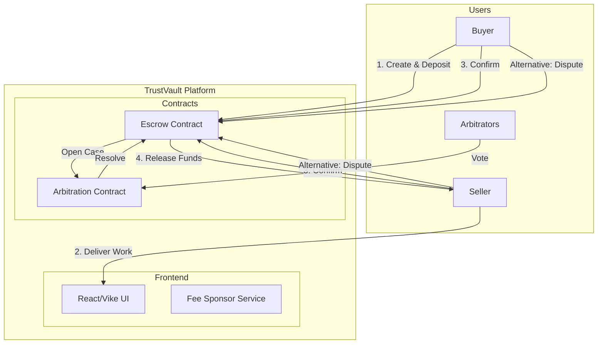

# 🔐 TrustVault

Decentralized escrow on Stellar.

[](https://github.com/sharifmdathar/trustvault/actions/workflows/ci.yml)

TrustVault is a secure, decentralized escrow platform built on the Stellar network using Soroban smart contracts. It enables trustless transactions between buyers and sellers with built-in arbitration and fee sponsorship for a seamless user experience.

---

## 🚀 Live Demo | Demo Video | Contract Addresses

- **Live Demo**: [trustvault-ten.vercel.app](https://trustvault-ten.vercel.app/)
- **Demo Video**: _Coming Soon_
- **Escrow Contract**: `CARKHHAAGQI2DOYNMMCOYAYH3MOITIZSNMT46FQVFPMDT2FFRPHRMLDC`
- **Arbitration Contract**: `CCZ3EPR7F3V6H5JF46XZ4TVQPFNQBE4WTT22EIMOQBLSQNLXVDP3WF2C`

---

## 🏗 Architecture Diagram



---

## 📖 How to Use (Step by Step)

1.  **Connect**: Link your Freighter wallet to the TrustVault dashboard.
2.  **Create**: As a Buyer, create a new vault by providing the Seller's address and the amount.
3.  **Fund**: Deposit the agreed-upon XLM into the secure escrow contract.
4.  **Confirm**: Once work is completed, both parties click **Confirm**.
5.  **Release**: Funds are automatically transferred to the Seller upon mutual confirmation.
6.  **Dispute**: If issues arise, flag a dispute to involve authorized arbitrators.

See the full [User Guide](USER_GUIDE.md) for more details.

---

## 📜 Contract Functions Explained

### Escrow Contract

- `create_vault`: Initializes a new escrow agreement between a buyer and seller.
- `deposit`: Transfers funds from the buyer's wallet to the contract's secure storage.
- `confirm`: Allows participants to signal completion. Triggers automatic release if both confirm.
- `flag_dispute`: Freezes the vault and signals the need for arbitration.

### Arbitration Contract

- `open_case`: Creates an arbitration case linked to a specific vault ID.
- `vote`: Allows authorized arbitrators to cast votes (Release to Buyer, Release to Seller, or Split).
- `get_case`: Retrieves the current state and results of an arbitration case.

---

## 🔒 Security Checklist

### Smart Contracts

- [x] Auth checks on all state-changing functions
- [x] Integer overflow protection (Rust native)
- [x] Input validation (amounts > 0, valid addresses)
- [x] No unauthorized fund access
- [x] Deadline enforcement
- [x] Dispute can only be raised by participants
- [x] Arbitrators verified before voting

### Frontend

- [x] No private keys in code
- [x] Contract IDs from environment variables
- [x] Transaction signing client-side only
- [x] HTTPS enforced on deployment
- [x] Sponsor key kept server-side only

### Operations

- [x] Sponsor account funded with limits
- [x] Error messages don't expose internals
- [x] All contract calls have error handling

---

## 📱 Mobile Screenshot

_Coming Soon_

---

## 📊 Metrics Dashboard Screenshot

_Coming Soon_

---

## ⛽ Fee Sponsorship Explanation

TrustVault leverages Stellar's **Fee Bump Transactions** to provide a "gasless" experience for users.

- A dedicated **Sponsor Account** covers the network fees for all contract interactions.
- Users only need to sign the inner transaction; the platform wraps it in a fee-bump signed by the sponsor.
- This removes the friction of maintaining XLM for gas, making the platform accessible to all.

---

## 💻 Local Setup Instructions

### Prerequisites

- [Bun](https://bun.sh/)
- [Stellar CLI](https://developers.stellar.org/docs/build/smart-contracts/getting-started/setup)
- Rust & wasm32 target

### Steps

1.  **Clone the Repo**:
    ```bash
    git clone https://github.com/sharifmdathar/trustvault.git
    cd trustvault
    ```
2.  **Install Dependencies**:
    ```bash
    cd frontend && bun install
    ```
3.  **Configure Environment**:
    Create a `.env` file in the `frontend` directory:
    ```env
    VITE_ESCROW_CONTRACT_ID=your_escrow_id
    VITE_ARBITRATION_CONTRACT_ID=your_arbitration_id
    VITE_NETWORK=testnet
    VITE_SOROBAN_URL=https://soroban-testnet.stellar.org
    VITE_SPONSOR_SECRET=YOUR_SPONSOR_SECRET
    ```
4.  **Run Development Server**:
    ```bash
    bun run dev
    ```
5.  **Build Contracts** (Optional):
    ```bash
    cd contracts/escrow && stellar contract build
    ```

---

_Built with ❤️ for the Stellar ecosystem._
